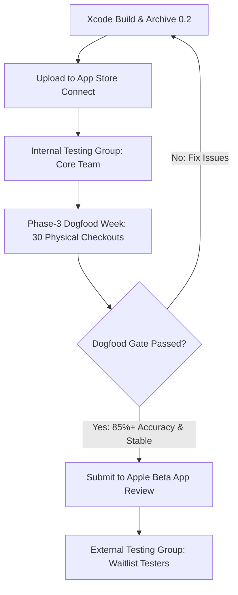

# PickMe — TestFlight Runbook & Distribution Guide

**Target Version:** `0.2 (1)`  
**Bundle Identifier:** `ca.pickme.cardcopilot`  
**Display Name:** `PickMe`  
**App Store Listing Name:** `PickMe: Card Copilot` (per Decision Record D1)  
**Parent Strategy:** Phase 4 Launch Spec (`docs/plans/2026-08-16-phase4-launch-spec.md` chunk 4f)  

---

## 1. Release Architecture & Gating Overview

PickMe follows a two-tier TestFlight rollout:
1. **Tier 1 (Internal Group — Immediate):** Deployed instantly to the owner and internal team upon build upload. No Apple review required. Used to run the **Phase-3 Dogfood Week**.
2. **Tier 2 (External Group — Strictly Gated):** Distributed to waitlist testers **ONLY AFTER** the Phase-3 Dogfood Week gate criteria are verified. Requires Apple Beta App Review.



> [!IMPORTANT]
> **THE DOGFOOD-WEEK GATE IS A HARD STOP.**
> Do not invite external testers until the owner has completed **30 physical checkouts** with the app, verified that ambient notifications fire according to Rule A3 (advantage > threshold, merchant confidence high, not muted), and confirmed that the local SwiftData store maintains zero data-loss bugs.

---

## 2. Owner Prerequisites & Account Setup

### 2.1 Apple Developer Program Enrollment (Individual)
- **Account Type:** **Individual** (per chunk 4f / Decision Record D2; organizational enrollment with D-U-N-S is deferred to Phase 5 public launch).
- **Cost:** $99 USD/year.
- **Process:**
  1. Open the [Apple Developer App](https://apps.apple.com/app/apple-developer/id640199958) on an iPhone/iPad or go to [developer.apple.com/programs/enroll](https://developer.apple.com/programs/enroll/).
  2. Sign in with the owner Apple ID (`zmuwwakil18@icloud.com`).
  3. Complete identity verification (photo ID upload + biometric selfie).
  4. Complete payment and accept the Apple Developer Program License Agreement.

### 2.2 Account Roles & Certificates
- Xcode will automatically manage signing certificates under the Development Team (`MC8XJ6GXBM` / Zubair Muwwakil).
- Automatic code signing is enabled in `App/CardCopilot.xcodeproj` for both Debug and Release configurations.

---

## 3. App Store Connect App Registration

1. Log in to [App Store Connect](https://appstoreconnect.apple.com).
2. Go to **Apps** → click **"+"** → **New App**.
3. Fill in the required fields:
   - **Platforms:** `iOS`
   - **Name:** `PickMe: Card Copilot`  
     *(Compound form required per Decision Record D1 for ASO clarity and App Store name uniqueness against overseas ride-hailing apps)*
   - **Primary Language:** `English (Canada)` or `French (Canada)`
   - **Bundle ID:** Select `ca.pickme.cardcopilot` (if not listed, create it under Certificates, Identifiers & Profiles → Identifiers → App IDs with capabilities: *Associated Domains* for Clerk, and *Push Notifications / Background Modes*).
   - **SKU:** `ca.pickme.cardcopilot.ios` (or `pickme-ios-001`)
   - **User Access:** `Full Access`
4. Click **Create**.

---

## 4. Archiving and Uploading the Build

### 4.1 Automated Build Configuration Verification
Before archiving, verify the project build settings:
- **Display Name (`CFBundleDisplayName`):** `PickMe` (configured via `INFOPLIST_KEY_CFBundleDisplayName` and `InfoPlist.xcstrings`).
- **Bundle ID (`PRODUCT_BUNDLE_IDENTIFIER`):** `ca.pickme.cardcopilot`
- **Marketing Version (`MARKETING_VERSION`):** `0.2`
- **Build Number (`CURRENT_PROJECT_VERSION`):** `1` (increment by 1 for each successive upload)
- **Export Compliance (`ITSAppUsesNonExemptEncryption`):** `false` (included in `Info.plist` to bypass manual export compliance forms on upload)
- **Background Modes:** `location` (for `CLMonitor` / region geofencing arrival alerts)

### 4.2 Building and Archiving via Command Line

Run from the repository root:

```bash
# 1. Clean previous build products
rm -rf build/CardCopilot.xcarchive

# 2. Archive the app
xcodebuild archive \
  -project App/CardCopilot.xcodeproj \
  -scheme CardCopilot \
  -destination "generic/platform=iOS" \
  -archivePath build/CardCopilot.xcarchive

# 3. Verify archive contents
ls -la build/CardCopilot.xcarchive/Products/Applications/
```

### 4.3 Uploading to App Store Connect

#### Option A: Xcode GUI Organizer (Recommended for First Upload)
1. In Xcode, select **Window** → **Organizer** (or `Cmd + Option + Shift + O`).
2. Select the latest `CardCopilot` archive under **Archives**.
3. Click **Distribute App** → Select **TestFlight & App Store** (or **Custom** → **App Store Connect**).
4. Distribution options:
   - Select **Upload**.
   - Check **Manage Version and Build Number** (or keep automatic).
   - Automatically manage signing with Team `MC8XJ6GXBM`.
5. Click **Upload**. Processing typically takes 5–15 minutes.

#### Option B: Command Line (altool / notarytool)
Using an App Store Connect API Key (generated in App Store Connect → Users and Access → Integrations → App Store Connect API):

```bash
xcrun altool --upload-app \
  -f build/CardCopilot.xcarchive/Products/Applications/CardCopilot.app \
  -t ios \
  --apiKey <KEY_ID> \
  --apiIssuer <ISSUER_UUID>
```

---

## 5. Export Compliance & Encryption Resolution

PickMe sets `<key>ITSAppUsesNonExemptEncryption</key><false/>` in `App/Info.plist`.

- **Why:** The app uses HTTPS for Clerk authentication and optional backend sync (`moneytalks.zubairmuwwakil.com`), which qualifies as exempt encryption under Category 5, Part 2 of the U.S. Export Administration Regulations (EAR).
- **Result:** App Store Connect automatically clears the export compliance step on processing. No manual compliance document upload is required.

---

## 6. TestFlight Configuration & Review Submission

### 6.1 TestFlight Beta App Review Information
In App Store Connect → **Apps** → **PickMe** → **TestFlight** tab → **App Review Information** (left sidebar):

1. **Beta App Review Notes:**  
   Copy the complete text from [`docs/compliance/testflight-beta-notes.md`](docs/compliance/testflight-beta-notes.md) (Part A).  
   *Summary of points covered: ambient calculator scope, no money management / banking access, on-device SwiftData architecture, optional Apple Wallet Shortcut capture, background location justification for geofencing, and reviewer walkthrough.*

2. **Sign-In Information (Guideline 2.1(a)):**
   - Check **"Sign-in required"**
   - **User Name / Email:** Provide active demo user (e.g. `reviewer@zubairmuwwakil.com`)
   - **Password:** Provide demo password
   - **Notes:** *"The core recommendation and local checkout flows work 100% signed out without an account. Demo credentials are provided to test optional backend account sync."*

3. **Contact Information:**
   - **First Name / Last Name:** Zubair Muwwakil
   - **Email Address:** `zmuwwakil18@icloud.com`
   - **Phone Number:** Owner direct contact phone

4. **Backend Status Check:**
   - Confirm backend at `https://moneytalks.zubairmuwwakil.com` is live and reachable before submitting.

### 6.2 "What to Test" Release Notes
In App Store Connect → TestFlight → Build `0.2 (1)` → **What to Test**:

Copy the bilingual release notes from [`docs/compliance/testflight-beta-notes.md`](docs/compliance/testflight-beta-notes.md) (Part B):
- **English (en-CA / en-US):** Onboarding catalogue picker, checkout calculations, ambient arrival alerts, and settings deletion paths.
- **French (fr-CA):** Configuration du portefeuille, recommandations, alertes ambiantes et paramètres.

---

## 7. Testing Groups & Rollout Sequence

### Step 7.1: Internal Testing Group ("Core Team")
1. In TestFlight → **Internal Testing** → click **"+"** → Create group: `Core Team`.
2. Add the owner Apple ID (`zmuwwakil18@icloud.com`) and any internal collaborators.
3. Under **Builds**, add Build `0.2 (1)`.
4. **Status:** Available immediately upon upload (no Apple review needed).
5. Install via the TestFlight app on the owner's iPhone.

---

### Step 7.2: The Phase-3 Dogfood-Week Gate (CRITICAL GATE)

Run the **Phase-3 Dogfood Week** on the owner device before opening external testing:

| Metric / Objective | Target Bar | Verification Method |
| :--- | :--- | :--- |
| **Physical Checkouts** | 30 real-world store visits | Run checkout recommendations across grocery, dining, gas, pharmacy, etc. |
| **Recommendation Accuracy** | ≥ 85% category precision | Compare recommended card vs truth graph actual earn rate |
| **Ambient Firing Rule (A3)** | Silence is default; fires only when advantage > threshold & confidence high | Verify geofence pings fire at saved spots and do not spam |
| **Exit Dwell Capture** | Dwell > 2 min triggers exit amount prompt | Confirm exit capture notification attaches to arrival visit |
| **Local Data Integrity** | Zero crashes, zero SwiftData data loss | Check prediction logs, wallet setup state, and sync status |

---

### Step 7.3: External Testing Group ("Waitlist Alpha")
*Only proceed after Step 7.2 is fully satisfied and signed off.*

1. In TestFlight → **External Testing** → click **"+"** → Create group: `Waitlist Alpha`.
2. Select Build `0.2 (1)` → Click **Submit for Beta App Review**.
3. Wait for Apple Beta Review approval (typically 24–48 hours for the initial build).
4. Once approved:
   - **Option A (Email Invite):** Add emails from the Phase 4d waitlist table (`WaitlistEntry`). Testers receive an email with an install link.
   - **Option B (Public Link):** Enable Public Link, set tester limit (e.g. 25 testers), and share with selected waitlist applicants.

---

## 8. Tester Onboarding & Feedback Expectations

### 8.1 First-Run Onboarding Flow (Chunk 4e)
When a tester installs the app:
1. **Wallet Selection:** Tester chooses their cards from the 10-card catalogue.
2. **Card Conditions:** Sets condition toggles (e.g., Rogers Mastercard 2% with Shaw/Rogers service).
3. **Default Card & Threshold:** Sets fallback card and switch threshold (default 0.5% / $0.25).
4. **Optional Account Sign-in:** Tester can use Clerk authentication or test fully offline.

### 8.2 Feedback Collection & Monitoring
- **TestFlight In-App Feedback:** Testers take a screenshot, annotate issues, and submit directly through TestFlight.
- **Crash Reporting:** Monitor crashes in App Store Connect → TestFlight → **Crashes**.
- **Issue Tracking:** Log reported card discrepancies, missing Canadian merchants, or notification timing bugs directly into repo issues / Phase 5 backlog.

---

## 9. Troubleshooting & Common Blockers

| Issue / Symptom | Cause | Solution |
| :--- | :--- | :--- |
| **Missing Code Signing Identity** | Development certificate not installed locally | In Xcode Settings → Accounts → Download Manual Profiles or select "Automatically manage signing". |
| **Export Compliance Prompt in App Store Connect** | `ITSAppUsesNonExemptEncryption` missing in `Info.plist` | Verify `<key>ITSAppUsesNonExemptEncryption</key><false/>` is in `App/Info.plist`. |
| **Notification Sender reads "CardCopilot" instead of "PickMe"** | `INFOPLIST_KEY_CFBundleDisplayName` missing from project target | Ensure `INFOPLIST_KEY_CFBundleDisplayName = "PickMe"` is set on both Debug and Release configs in `project.pbxproj`. |
| **Reviewer Rejection: Guideline 2.1(a) Login** | Backend down or credentials invalid | Verify `moneytalks.zubairmuwwakil.com` is up and test demo credentials before submitting. |
| **Reviewer Query: Guideline 2.5.4 Background Location** | Location background mode scrutinized | Refer reviewer to section in Beta Review Notes explaining `CLMonitor` region arrival alerts. |
